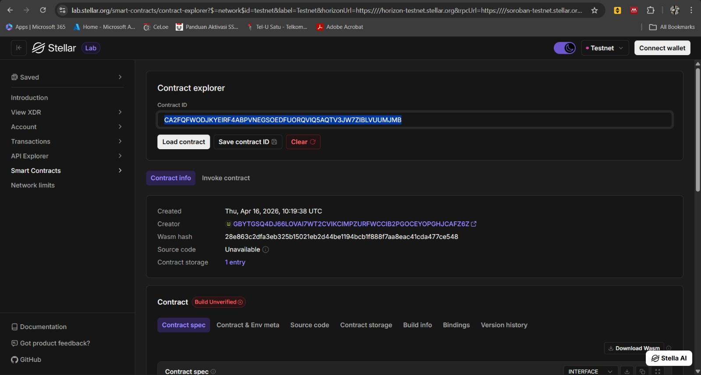
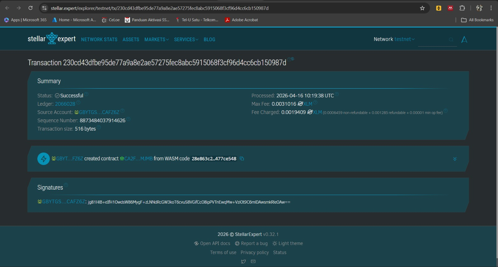

📔 THE TICKET LEDGER 📔
⚡ PROJECT TITLE: DECENTRALIZED CONCERT TICKETS
🕵️‍♂️ PROJECT DESCRIPTION
The Decentralized Concert Tickets contract is a specialized Web3 ticketing system built on the Stellar Soroban blockchain. It provides a secure, immutable record for concert ticket purchases and ownership. By tying each ticket to a cryptographic wallet address and enforcing strict authorization checks, it prevents counterfeiting and unauthorized cancellations. Stop relying on vulnerable centralized databases; start relying on the ledger.

🔭 PROJECT VISION
"True ownership for every seat."

We envision a world where ticketing fraud is impossible, backed by the security of a global blockchain. Our goal is to:

* Codify True Ownership: Tying concert seats directly to cryptographic identities.
* Cryptographic Security: Ensuring that actions like purchasing or cancelling require undeniable authorization.
* Immutable Verification: Ensuring that once a ticket is bought, it stands as an unforgeable fact.

🛠 KEY FEATURES
[SECURE PURCHASING] - Buy tickets that are inextricably linked to your Stellar Address.
[CRYPTOGRAPHIC AUTH] - Uses `require_auth()` to enforce that every transaction is cryptographically signed.
[OWNERSHIP VALIDATION] - Strict checks prevent malicious users from cancelling others' tickets.
[ON-CHAIN LOGGING] - Every purchase is a permanent part of the Stellar ledger.

⛓ DEPLOYED SMARTCONTRACT DETAILS
+-----------------------------------------------------------------------+
| CONTRACT ID: CA2FQFWODJKYEIRF4ABPVNEGSOEDFUORQVIQ5AQTV3JW7ZIBLVUUMJMB |
+-----------------------------------------------------------------------+
📸 REGISTRY SCREENSHOT

🔮 FUTURE SCOPE
Secondary Markets: Securely sell or transfer tickets to other wallets directly on-chain.
Dynamic Pricing: Algorithmic pricing based on network demand.
NFT Integration: Issue commemorative NFTs for attendees upon event entry.
Multi-Event Categorization: Support for festivals and multi-day passes.

"I'm not in the nosebleeds, I'm just in a different block."